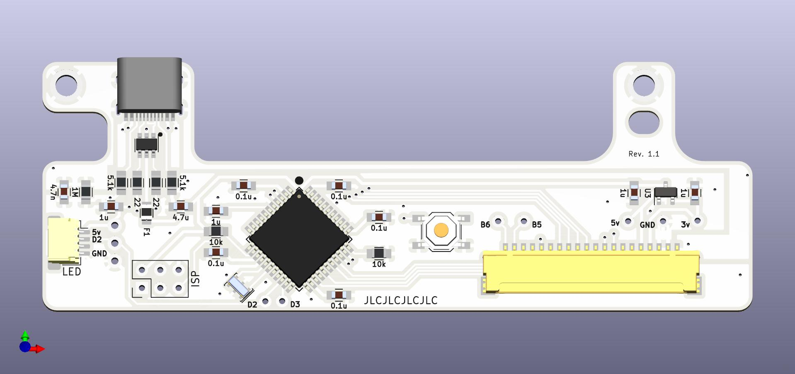
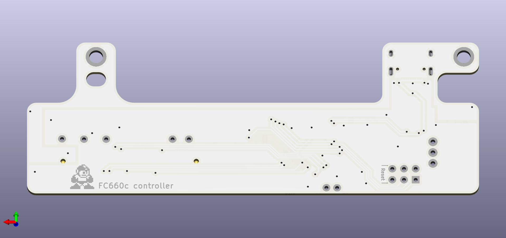

# FC660C Controller with USB-C

This revision was designed to maximize RGB underglow in the Norbauer Heavy-6 polycarb case.  To that end the reset button has been moved and is not accessible when installed in the case.  

RGB underglow lights can be added via a JST connector. Rooski15 has a great how to guide [here](https://www.keebtalk.com/t/adding-rgb-to-fc660c-with-hasu-controller/14484)

## Features
- Fully compatible with keymaps for Hasu's FC660C controller
- USB-C port (required small case modification)
- ESD protection circuit

## Bill of materials (BOM)
Please have a look at the manufacuring files!

_Ignore Rev1.0 it had problems with the LED connector.  Leaving in the Repo incase someone needs to refer back to them._
